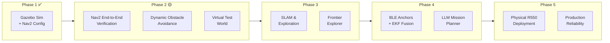

# R550 Project Plan — Autonomous Exploration & Navigation

> **Single source of truth** for the R550 development journey. This plan merges the original 5-step learning objectives with the [development layers](0.1%20Roadmap.md) and LLM integration strategy. Each phase maps to specific development layers and cross-references detailed docs.

---

## Project Objectives

1. **Autonomous Exploration & SLAM** — Automatically explore an unknown space and construct a 2D occupancy grid map
2. **Point-to-Point Navigation (A → B)** — Plan optimal, collision-free routes from start to goal coordinates
3. **Dynamic Obstacle Avoidance** — Reactively detect and maneuver around sudden or moving obstacles
4. **LLM-Enhanced Intelligence** — Natural language mission control, adaptive recovery, and scene understanding

---

## Development Journey Overview



---

## Phase 1: Simulation Foundation ✅

> **Layer:** 1 (Simulation Integration) · **Status:** Complete

### Goals
Build a virtual twin of the R550 to validate physical motion and sensor outputs safely.

### Completed Items
- [x] **URDF/Xacro Design** — R550 chassis, 4-wheel skid-steer, sensor mounts. Resolved spacing, coordinate reflection, and gravity/inertia issues
- [x] **Sensor Emulation** — Gazebo LiDAR plugin (`gpu_ray`) publishing `/scan`. 360° coverage, 12m range, Gaussian noise
- [x] **Motor Control Plugin** — `libgazebo_ros_diff_drive.so` skid-steer controller. `/cmd_vel` → joint movements, publishes `/odom` + TF
- [x] **Joint State Publisher** — Wheel rotation data broadcast at 50Hz for RViz2/Foxglove visualization
- [x] **Nav2 Configuration** — Mapless odom-based navigation: A* planner (NavFn) + DWB controller + behavior server
- [x] **Docker Dev Environment** — XFCE desktop via RDP, Foxglove Bridge on port 8765

### Key Docs
- Robot model & physics tuning → [1.0 Overview](1.0%20Overview.md)
- Nav2 architecture deep dive → [1.1 Navigation](1.1%20Navigation.md) Part 1-2
- Package architecture → [1.1 Navigation](1.1%20Navigation.md) Part 2.1

---

## Phase 2: Navigation Verification & Dynamic Avoidance 🟡

> **Layer:** 1-2 (Simulation → Early Sim-to-Real) · **Status:** Next

### Step 2A: End-to-End Nav2 Verification

**Goal:** Confirm the robot can autonomously navigate from A to B in Gazebo.

- [ ] Build a **virtual testing world** — closed environment with walls, hallways, and simple obstacles (Gazebo `.world` file or SDF)
- [ ] Launch full stack: `r550_sim.launch.py` + `r550_nav2.launch.py`
- [ ] Send navigation goal via CLI and verify path planning + execution:
  ```bash
  ros2 action send_goal /navigate_to_pose nav2_msgs/action/NavigateToPose \
    "{pose: {header: {frame_id: 'odom'}, pose: {position: {x: 3.0, y: 2.0}}}}"
  ```
- [ ] Verify in Foxglove/RViz2: global path rendered, robot follows path, goal checker triggers "arrived"
- [ ] Test edge cases: goal behind obstacle, goal at map edge, goal at current position

**Deliverables:** Working A→B navigation demo, screenshots/recordings for reference

### Step 2B: Dynamic Obstacle Avoidance

**Goal:** Ensure the robot safely detours around sudden obstacles without freezing or crashing.

- [ ] **Local controller tuning** — Fine-tune DWB critic weights for reactive avoidance:
  - Increase `BaseObstacle.scale` from 0.02 → higher value if robot drives too close to obstacles
  - Tune `sim_time` (how far ahead the controller simulates) for faster reactions
- [ ] **Dynamic costmap verification** — Confirm obstacle layer instantly ingests `/scan` data and inflates obstacles in real-time
- [ ] **Moving obstacle test** — Spawn moving objects in Gazebo directly in the robot's planned route:
  - Verify the local planner computes a detour
  - Verify the robot resumes original route after obstacle passes
- [ ] **Recovery behavior test** — Intentionally box the robot in and verify spin/backup/wait cycle activates

**Deliverables:** Tuned DWB parameters, moving obstacle test results

### 🤖 LLM Opportunities (Phase 2)

| Opportunity | Details |
|-------------|---------|
| **Gazebo world generation** | "Create a Gazebo world with a 10m×8m room, two internal walls forming an L-shaped corridor, and 3 random box obstacles" → LLM generates `.world` SDF file |
| **Parameter tuning advisor** | Robot oscillates or drives too close to walls → feed nav logs to LLM → it suggests DWB critic weight adjustments |
| **Test scenario generation** | "Generate 10 test scenarios with increasing difficulty" → LLM produces a script that spawns obstacles at varying positions/speeds |

---

## Phase 3: SLAM & Autonomous Exploration

> **Layer:** 2-3 (Perception & Sensor Fusion) · **Status:** Planned

### Step 3A: SLAM Integration

**Goal:** Build maps while navigating using `slam_toolbox`.

- [ ] Add `slam_toolbox` to `package.xml` dependencies
- [ ] Create `r550_slam.launch.py` — launches `slam_toolbox` in online async mode
- [ ] Configure SLAM params: scan topic (`/scan`), base frame (`base_footprint`), odom frame (`odom`)
- [ ] Drive robot manually (teleop) through the test world, verify live map construction in RViz2
- [ ] Save the generated map (`ros2 run nav2_map_server map_saver_cli`)
- [ ] Switch Nav2 from mapless mode to map-based mode:
  - Re-add `static_layer` to global costmap
  - Add `map_server` and `amcl` to the launch chain
  - Change `global_frame` from `odom` to `map`

**Key decision:** After SLAM, the TF tree gains a new level:
```
map → odom → base_footprint → base_link → laser_link
      ↑ provided by AMCL (corrects odometry drift against the map)
```

### Step 3B: Frontier Exploration (Autonomous Mapping)

**Goal:** The robot systematically explores and maps unknown space on its own.

- [ ] Set up or write a **Frontier Exploration** node — identifies boundaries between known free space and unknown space
- [ ] Implement the exploration loop:
  1. Identify frontier cells on the SLAM map edge
  2. Select the most promising frontier (largest, closest, or most information-gain)
  3. Send Nav2 goal to that frontier
  4. Update SLAM map during travel
  5. Repeat until no frontiers remain (map fully enclosed)
- [ ] Options: `explore_lite` package, `m-explore` package, or custom Python node
- [ ] Test in Gazebo: robot placed in unknown room → autonomously explores and builds complete map

**Deliverables:** Complete 2D map of test environment, autonomous exploration demo

### 🤖 LLM Opportunities (Phase 3)

| Opportunity | Details |
|-------------|---------|
| **Exploration strategy** | LLM advises frontier selection: "Prioritize the long corridor to the north — it likely connects to more rooms based on the building's rectangular footprint" |
| **Map quality assessment** | LLM analyzes generated map: "The northeast corner has low scan density — recommend re-exploration at slower speed for better coverage" |
| **SLAM parameter tuning** | "Map has loop closure errors" → LLM suggests adjusting `slam_toolbox` correlation search size and resolution |

---

## Phase 4: Enhanced Sensing & Intelligence

> **Layer:** 3-4 (Perception + Application Logic) · **Status:** Planned

### Step 4A: Bluetooth Anchor Integration

**Goal:** Add absolute position correction to eliminate odometry drift.

- [ ] Write `r550_bt_anchor` ROS 2 Python node — reads BLE hardware, publishes `PoseWithCovarianceStamped`
- [ ] Configure `robot_localization` EKF — fuse wheel odometry + BLE position
- [ ] Tune EKF covariances: wheels (high trust for velocity), BLE (high trust for position)
- [ ] Wire Nav2 to use `/odometry/filtered` instead of raw `/odom`
- [ ] Disable diff_drive TF publishing, let EKF publish `odom → base_footprint`

**Detailed design:** [1.1 Navigation](1.1%20Navigation.md) Part 4

### Step 4B: LLM Mission Planner

**Goal:** Natural language command → multi-step waypoint sequences.

- [ ] Build location registry (YAML file with named positions from SLAM map)
- [ ] Create `r550_mission_planner` ROS 2 node — action client for Nav2
- [ ] Start with rule-based command parsing ("go to X", "patrol route Y")
- [ ] Add LLM integration for natural language decomposition
- [ ] Add feedback loop: navigation results → LLM → adaptive re-planning
- [ ] Add error handling: what to do when a step fails

**Detailed design:** [1.1 Navigation](1.1%20Navigation.md) Part 6

### 🤖 LLM Opportunities (Phase 4)

| Opportunity | Details |
|-------------|---------|
| **Natural language missions** | "Check all three meeting rooms, then go charge" → LLM decomposes into ordered waypoints |
| **Sensor fusion arbitration** | BLE position jumps 3m → LLM: "Multipath interference detected, temporarily reducing BLE trust weight" |
| **Scene understanding** | Camera + VLM: "The door to Lab 3 is closed" → LLM: "Wait 10 seconds, then try alternate entrance" |
| **Adaptive recovery** | Nav2 reports persistent failure → LLM analyzes sensor data + map context → suggests alternative strategy |

---

## Phase 5: Physical Deployment & Production

> **Layer:** 2 + 4-5 (Sim-to-Real + Application + Production) · **Status:** Future

### Step 5A: Physical R550 Deployment

**Goal:** Transfer simulation-hardened code to the real Wheeltec R550.

- [ ] **Hardware bringup** — Launch physical drivers on onboard computer:
  - Motor controller driver (map ROS 2 `/cmd_vel` → physical motors)
  - Physical LiDAR driver (RPLiDAR, YDLiDAR, or similar)
  - IMU driver (if equipped)
  - Wheel encoder interface
- [ ] **Odometry fusion** — Configure `robot_localization` EKF to fuse:
  - Wheel encoder odometry (noisy but continuous)
  - IMU data (heading stability)
  - BLE anchors (absolute position correction)
- [ ] **Parameter migration** — Adjust Nav2 params for real-world:
  - Actual wheel diameter and separation (measured, not designed)
  - Real LiDAR min/max range and noise characteristics
  - Motor response curves (acceleration limits, dead zones)
- [ ] **Calibration runs** — Drive robot in known patterns (straight line, square) to verify odometry accuracy
- [ ] **Verification run** — Run autonomous mapping and point-to-point routing in physical room

### Step 5B: Production Hardening

**Goal:** Reliable 24/7 operation without human supervision.

- [ ] Watchdog supervisor — auto-restart crashed nodes
- [ ] Battery management — monitor level, auto-return-to-charger
- [ ] Remote monitoring — telemetry dashboard (Foxglove or custom web UI)
- [ ] Safety systems — E-stop, geofencing, speed limits near people
- [ ] OTA updates — deploy config changes remotely

### 🤖 LLM Opportunities (Phase 5)

| Opportunity | Details |
|-------------|---------|
| **Sim-to-real diagnosis** | "Robot curves left when commanded straight" → LLM: "Likely wheel diameter mismatch. Left wheel 79.2mm vs right 80.0mm. Adjust URDF or add software compensation" |
| **Incident reports** | Auto-generated: "At 14:32, robot got stuck in hallway due to new obstacle. Recovery: spin + backup. Total delay: 47s" |
| **Predictive maintenance** | "Motor current draw increased 15% over 2 weeks — bearing wear suspected, schedule service" |
| **Self-healing config** | Nav success rate drops 95% → 70% after furniture rearrangement → LLM auto-adjusts inflation radius → rate recovers |

---

## Status Dashboard

| Phase | Step | Description | Status | Layer |
|-------|------|-------------|--------|-------|
| **1** | 1 | Gazebo simulation environment | ✅ Done | 1 |
| **1** | — | Nav2 mapless navigation config | ✅ Done | 1 |
| **2** | 2A | Nav2 end-to-end verification | 🟡 Next | 1 |
| **2** | 2B | Dynamic obstacle avoidance | ⬜ Queued | 1-2 |
| **3** | 3A | SLAM integration (`slam_toolbox`) | ⬜ Planned | 2-3 |
| **3** | 3B | Frontier exploration (autonomous mapping) | ⬜ Planned | 2-3 |
| **4** | 4A | Bluetooth anchor + EKF fusion | ⬜ Planned | 3 |
| **4** | 4B | LLM mission planner | ⬜ Planned | 4 |
| **5** | 5A | Physical R550 hardware deployment | ⬜ Future | 2 |
| **5** | 5B | Production reliability & monitoring | ⬜ Future | 4-5 |

---

## Cross-Reference Index

| Topic | Document | Phase |
|-------|----------|-------|
| URDF model & Gazebo physics | [1.0 Overview](1.0%20Overview.md) | 1 |
| Nav2 deep dive (5 systems) | [1.1 Navigation](1.1%20Navigation.md) Part 1-2 | 1-2 |
| Nav2 package architecture | [1.1 Navigation](1.1%20Navigation.md) Part 2.1 | 1-2 |
| TF tree design | [1.1 Navigation](1.1%20Navigation.md) Part 3 | 1, 3, 5 |
| Bluetooth anchor integration | [1.1 Navigation](1.1%20Navigation.md) Part 4 | 4 |
| LLM mission planner design | [1.1 Navigation](1.1%20Navigation.md) Part 6 | 4 |
| Development layers & skills | [0.1 Roadmap](0.1%20Roadmap.md) | All |
| LLM integration strategy | [0.1 Roadmap](0.1%20Roadmap.md) (per-layer tables) | All |
