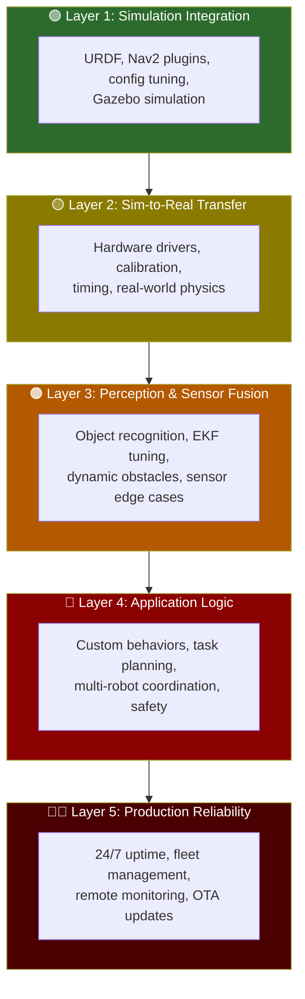
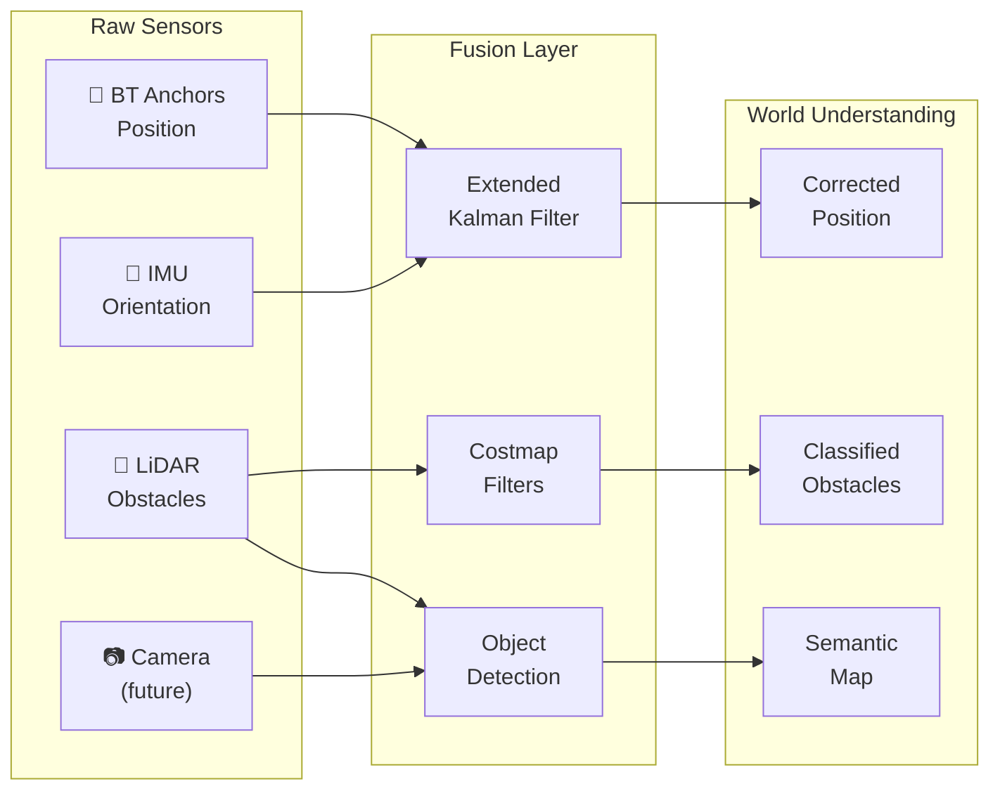
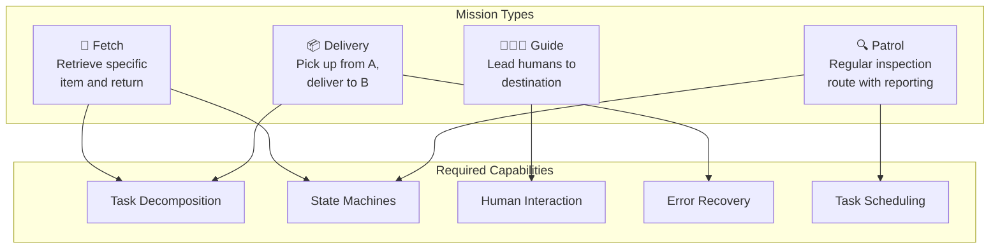
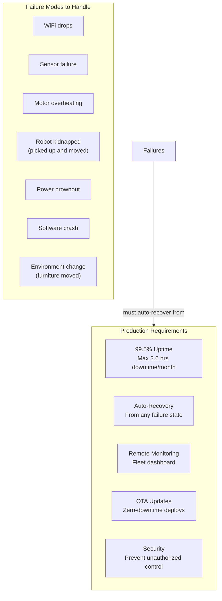
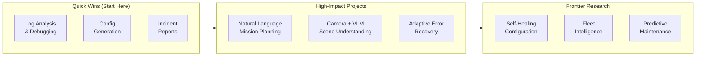

# R550 Development Roadmap — From Simulation to Production Intelligence

> This document serves as a cross-reference guide for all future R550 development work. It maps out the 5 layers of robot development, the skills required at each level, and — critically — where LLM intelligence can be integrated at every layer to make the R550 a truly intelligent autonomous platform.

---

## The 5 Layers of Robot Development

---

## Layer 1: 🟢 Simulation Integration

**Status: ✅ Current R550 state**

### What It Is
Assembling existing ROS 2 components — URDF models, Gazebo plugins, Nav2 configuration — into a working simulated robot. This is the "plugin + glue" layer.

### What You've Done
- Built R550 URDF with 4WD skid-steer, LiDAR, and tuned Gazebo physics
- Configured Nav2 for mapless odom-based navigation (A* planner + DWB controller)
- Set up Docker container with XFCE + Foxglove Bridge for remote visualization

### Core Skills

| Skill | Description | R550 Example |
|-------|-------------|-------------|
| URDF/Xacro | Robot 3D model description | `r550.urdf.xacro` — chassis, wheels, LiDAR |
| Launch files | Multi-node orchestration | `r550_sim.launch.py`, `r550_nav2.launch.py` |
| ROS 2 ecosystem | Knowing which packages exist and what they do | Choosing Nav2, Gazebo, Foxglove |
| Parameter tuning | YAML config for algorithm behavior | `nav2_params.yaml` — DWB critics, costmap layers |
| TF tree design | Coordinate frame hierarchy | `odom → base_footprint → base_link → laser_link` |

### Hard Parts at This Layer
- Understanding the TF tree (it's invisible and errors are cryptic)
- Getting Gazebo physics stable (inertia, friction, contact parameters)
- Knowing which plugin to choose when 5 alternatives exist

### 🤖 LLM Integration Opportunities

| Opportunity | How It Works | Difficulty |
|-------------|-------------|-----------|
| **Config generation** | "Generate Nav2 params for a 30cm wide skid-steer robot with 12m LiDAR" → LLM produces `nav2_params.yaml` with correct values | Low |
| **URDF debugging** | Feed TF tree errors to LLM → it identifies missing joints or frame mismatches | Low |
| **Plugin recommendation** | "My robot needs to follow smooth curves" → LLM recommends Regulated Pure Pursuit over DWB with rationale | Low |
| **Parameter tuning advisor** | Robot oscillates during nav → feed logs to LLM → it suggests adjusting DWB critic weights | Medium |

---

## Layer 2: 🟡 Sim-to-Real Transfer

**Status: 🔜 Next milestone for R550**

### What It Is
Making the simulated robot work on real hardware. This is where the gap between "perfect simulation" and "messy reality" becomes painfully obvious.

### What Changes

| In Simulation | In Reality |
|--------------|-----------|
| Perfect odometry | Wheel slip, gear backlash, encoder noise |
| Clean LiDAR data | Glass reflections, sunlight interference, dust |
| Instant communication | USB latency (10-50ms), WiFi drops |
| Flat uniform floor | Carpet seams, thresholds, ramps, wet spots |
| Perfect motor response | Current limits, thermal throttling, dead zones |
| Unlimited compute | Onboard CPU thermal throttling under load |

### Core Skills

| Skill | Description | R550 Task |
|-------|-------------|----------|
| Hardware drivers | Communicating with physical sensors/motors | Writing ROS 2 nodes for Wheeltec motor controller |
| Calibration | Measuring real physical parameters | Actual wheel diameter, LiDAR mounting offset |
| PID tuning | Closed-loop motor control | Tuning velocity PID so `cmd_vel: 0.3` actually produces 0.3 m/s |
| Timing analysis | Ensuring real-time message flow | Profiling sensor → costmap → controller pipeline latency |
| Diagnostic tooling | Understanding what's wrong on a headless robot | `ros2 topic hz`, `ros2 doctor`, log analysis |

### Hard Parts at This Layer
- **No visual debugging** — can't open Gazebo on the real robot, must rely on topic introspection
- **Non-reproducible bugs** — hardware issues are intermittent (works 99 times, fails once)
- **Cascading failures** — one bad sensor reading propagates through the entire nav stack
- **Physical danger** — a software bug can damage the robot or hurt someone

### 🤖 LLM Integration Opportunities

| Opportunity | How It Works | Difficulty |
|-------------|-------------|-----------|
| **Log analysis & diagnosis** | Feed ROS 2 logs, TF warnings, topic rates to LLM → "Your LiDAR is publishing at 4Hz instead of 10Hz, likely a USB bandwidth issue" | Low |
| **Calibration assistant** | "My robot always curves left when told to go straight" → LLM suggests wheel diameter mismatch or IMU calibration steps | Medium |
| **Parameter auto-tuning** | LLM runs the robot with different PID gains, observes velocity tracking error, iterates toward optimal values | High |
| **Digital twin sync** | LLM compares sim vs. real behavior logs, identifies which sim parameters need adjustment to match reality | High |

---

## Layer 3: 🟠 Perception & Sensor Fusion

**Status: 📋 Planned (Bluetooth anchors are first step)**

### What It Is
Making the robot understand its environment beyond simple obstacle detection. Fusing multiple sensor sources into a coherent, trustworthy world model.

### What You'll Build

### Core Skills

| Skill | Description | R550 Task |
|-------|-------------|----------|
| Kalman filters | Fusing noisy sensor data optimally | EKF for wheels + Bluetooth anchors + IMU |
| Computer vision | Extracting info from camera images | Object detection, SLAM with visual features |
| Point cloud processing | Understanding 3D sensor data | Filtering LiDAR noise, ground plane removal |
| SLAM | Building maps while navigating | `slam_toolbox` for persistent map building |
| Coordinate math | Transforms, rotations, projections | Camera-to-robot frame transforms |

### Hard Parts at This Layer
- **Sensor trust:** When the LiDAR says "obstacle" but the camera sees nothing — who's right?
- **Edge cases:** Glass walls (invisible to LiDAR), mirrors (create phantom obstacles), black matte surfaces (absorb LiDAR), small cables on the floor (below scan plane)
- **Dynamic environments:** People walking, doors opening/closing — the costmap must update fast enough
- **BLE multipath:** Bluetooth signals bounce off walls, creating position "jumps." Your EKF covariance tuning must handle this

### 🤖 LLM Integration Opportunities

| Opportunity | How It Works | Difficulty |
|-------------|-------------|-----------|
| **Scene understanding** | Camera feed → Vision-Language Model → "There is a person with a cart blocking the hallway, they appear to be loading boxes" | Medium |
| **Anomaly detection** | LLM monitors sensor health: "LiDAR point density dropped 60% — possible dust on lens or sensor degradation" | Medium |
| **Semantic costmap annotations** | LLM + camera labels zones: "this area is a doorway" (slow down), "this is a charging station" (goal point), "this is a staircase" (forbidden zone) | High |
| **Sensor fusion arbitration** | When sensors disagree, LLM uses context: "BLE says position jumped 3m in 0.1s — impossible, this is multipath noise, increase BLE covariance temporarily" | High |
| **Dynamic obstacle prediction** | LLM observes: "Person has been walking left-to-right at 1.2 m/s for 3 seconds" → predicts trajectory → pre-emptively adjusts path | High |

---

## Layer 4: 🔴 Application Logic

**Status: 📋 Future — the LLM mission planner is a first step**

### What It Is
Making the robot do useful work beyond "go to (x, y)." This layer is where you write the most custom code — it's business logic for robots.

### Example Capabilities

### Core Skills

| Skill | Description | R550 Task |
|-------|-------------|----------|
| Behavior Trees (advanced) | Custom BT nodes beyond Nav2 defaults | "Approach shelf, align precisely, signal arrival" |
| State machines | Managing complex multi-phase operations | Delivery state: `IDLE → PICKUP → TRANSIT → DELIVER → RETURN` |
| ROS 2 actions/services | Custom inter-node communication | Mission planner ↔ Nav2 ↔ hardware actuators |
| Safety engineering | Preventing physical harm | E-stop, geofencing, speed limits near people |
| API design | External system integration | REST/MQTT interface for warehouse management system |

### Hard Parts at This Layer
- **Error combinatorics:** What if pickup succeeds but transit fails? What if battery dies mid-delivery? Every combination needs handling
- **Human interaction:** People are unpredictable — they block paths, move objects, give ambiguous commands
- **Multi-robot conflicts:** Two robots heading for the same narrow corridor — who yields?
- **Testing:** Can't unit-test a delivery workflow — need full integration testing with hardware-in-the-loop

### 🤖 LLM Integration Opportunities

> [!IMPORTANT]
> This layer has the HIGHEST LLM impact potential. The LLM essentially becomes the robot's "brain" for decision-making.

| Opportunity | How It Works | Difficulty |
|-------------|-------------|-----------|
| **Natural language missions** | "Deliver this to Lab 3, it's fragile so go slow" → LLM decomposes into waypoints with `max_vel_x: 0.15` override | Medium |
| **Adaptive error recovery** | Nav2 reports "stuck after 3 recovery attempts" → LLM analyzes context: "Try alternative route through corridor B" or "Request human help" | Medium |
| **Human interaction** | Person asks robot "where is the meeting room?" → LLM responds with speech + offers to guide them there | Medium |
| **Task prioritization** | Queue has 5 deliveries. LLM considers: distance, urgency, battery level, corridor congestion, time-of-day → optimal ordering | Medium |
| **Explainable decisions** | Manager asks "why did the robot take the long route?" → LLM explains: "The short route through Hall B was blocked by a loading cart at 14:32" | Low |
| **Multi-robot negotiation** | Two robot LLMs communicate: "I'm carrying urgent cargo, please yield corridor C" / "Acknowledged, rerouting via corridor D" | High |
| **Learning from experience** | LLM logs: "Route X fails 40% of the time between 12-1 PM (lunch traffic)" → automatically avoids it during those hours | High |

---

## Layer 5: 🔴🔴 Production Reliability

**Status: 🔮 Long-term**

### What It Is
Running the robot 24/7 in a real environment without someone watching it. This is systems engineering, not robotics — and it's where most commercial robot projects fail.

### Requirements

### Core Skills

| Skill | Description | R550 Task |
|-------|-------------|----------|
| Watchdog systems | Detecting and recovering from hangs | Process supervisor that restarts crashed nodes |
| Telemetry | Streaming robot health to cloud | Battery, motor temp, CPU load, nav success rate |
| OTA updates | Remote software deployment | Deploy new nav params without physical access |
| Security | Preventing hijacking | Authenticated ROS 2 DDS, encrypted Foxglove |
| Fleet management | Coordinating multiple robots | Central scheduler, traffic management |

### Hard Parts at This Layer
- **Unknown unknowns:** You can't predict every failure mode — someone will spill coffee on the floor, creating a slippery patch that causes the robot to spin out
- **Debugging remotely:** The robot is in a warehouse 500 miles away. You can't plug in a monitor
- **Graceful degradation:** If the LiDAR fails, can the robot navigate with just odometry at reduced speed? Or must it stop entirely?
- **Regulatory compliance:** Safety certifications, insurance, liability if the robot injures someone

### 🤖 LLM Integration Opportunities

| Opportunity | How It Works | Difficulty |
|-------------|-------------|-----------|
| **Predictive maintenance** | LLM monitors trends: "Motor current draw has increased 15% over 2 weeks — bearing may be wearing, schedule maintenance" | Medium |
| **Incident reports** | Robot gets stuck → LLM auto-generates: "At 14:32, robot R550-03 got stuck in Hallway B due to a newly placed trash bin. Recovery: spun 360°, backed up, rerouted. Resolution time: 47s" | Low |
| **Fleet intelligence** | "Robots 1 and 3 both reported difficulty in Zone C today. Likely a new obstacle or floor condition change. Dispatching inspection task" | Medium |
| **Root cause analysis** | Navigation failure log → LLM traces: "Goal failed → controller timeout → costmap showed phantom obstacle → LiDAR reported 0.3m range at 45° → this matches the new glass partition installed yesterday" | High |
| **Self-healing configs** | LLM detects: "Navigation success rate dropped from 95% to 70% after environment change" → auto-adjusts inflation radius and costmap parameters → rate recovers to 92% | High |
| **Natural language ops** | Ops engineer asks: "Why did robot 5 stop working at 3 AM?" → LLM queries logs, generates human-readable incident report with timeline and recommendations | Low |

---

## Developer Progression Roadmap

| Stage | Layers | What You Build | Key Skills to Develop |
|-------|--------|---------------|----------------------|
| **🟢 Beginner** | 1 | URDF, launch files, Nav2 config, Gazebo sim | ROS 2 CLI, YAML/XML, TF tree concepts |
| **🟡 Intermediate** | 1-2 | Hardware drivers, sensor calibration, sim-to-real | Python/C++ ROS nodes, PID control, hardware debugging |
| **🟠 Advanced** | 1-3 | EKF fusion, computer vision, SLAM, custom perception | Kalman filters, OpenCV, point cloud processing |
| **🔴 Senior** | 1-4 | Custom planners, application logic, fleet systems | Behavior trees, state machines, distributed systems |
| **🔴🔴 Principal** | 1-5 | Production reliability, autonomous operations | Systems engineering, safety certification, ML ops |

### Where LLM Skills Compound

---

## R550 Milestone Plan

> [!NOTE]
> The detailed phase plan with checklists and deliverables lives in [0.0 Project Goal](0.0%20Project%20Goal.md). Below is a summary view aligned to the development layers.

| Phase | Focus | Layers | Status |
|-------|-------|--------|--------|
| **1: Simulation Foundation** | URDF, Gazebo, Nav2 config | Layer 1 | ✅ Done |
| **2: Nav Verification & Avoidance** | End-to-end nav, DWB tuning, dynamic obstacles | Layer 1-2 | 🟡 Next |
| **3: SLAM & Exploration** | `slam_toolbox`, frontier exploration, map building | Layer 2-3 | ⬜ Planned |
| **4: Enhanced Sensing & Intelligence** | BLE anchors, EKF fusion, LLM mission planner | Layer 3-4 | ⬜ Planned |
| **5: Physical Deployment & Production** | Real hardware, calibration, monitoring, safety | Layer 2, 4-5 | ⬜ Future |

---

## Cross-Reference Index

| Topic | Primary Doc | Relevant Layer |
|-------|-----------|---------------|
| **Project plan & checklists** | [0.0 Project Goal](0.0%20Project%20Goal.md) | All |
| Nav2 architecture & components | [1.1 Navigation](1.1%20Navigation.md) Part 1-2 | Layer 1 |
| Nav2 package architecture | [1.1 Navigation](1.1%20Navigation.md) Part 2.1 | Layer 1 |
| TF tree design | [1.1 Navigation](1.1%20Navigation.md) Part 3 | Layer 1 |
| Bluetooth anchor integration | [1.1 Navigation](1.1%20Navigation.md) Part 4 | Layer 3 |
| LLM mission planner design | [1.1 Navigation](1.1%20Navigation.md) Part 6 | Layer 4 |
| Robot URDF & physics | [1.0 Overview](1.0%20Overview.md) | Layer 1 |
| Docker dev environment | [1.0 Overview](1.0%20Overview.md) | Layer 1 |
| Sim-to-real transfer | This document, Layer 2 | Layer 2 |
| Sensor fusion (EKF) | This document, Layer 3 | Layer 3 |
| Production reliability | This document, Layer 5 | Layer 5 |

