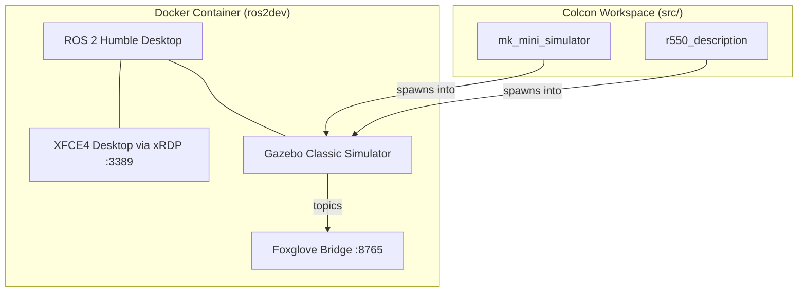
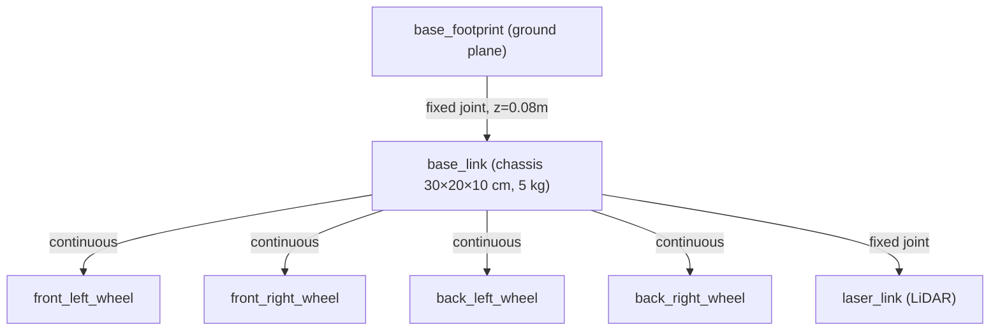
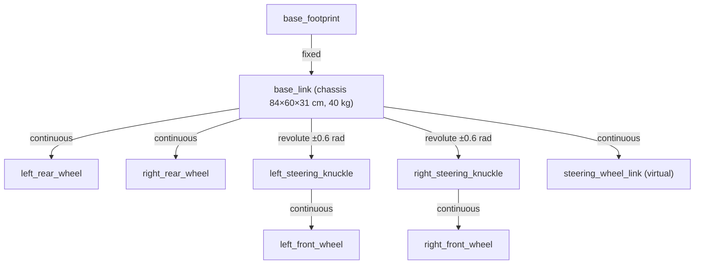

# ROS 2 R550 Project — Codebase Walkthrough

## Overview

This is a **ROS 2 Humble** robotics simulation workspace containing two robot packages, packaged inside a **Docker container** that provides a full graphical XFCE desktop accessible via RDP. The project is designed for simulating and developing robot models in **Gazebo** (classic, not Ignition) with remote visualization via **Foxglove Bridge**.

---

## Architecture Diagram

---

## Project Structure

| Path | Purpose |
|------|---------|
| [docker/](file:///home/coder/work/ros2/r550/docker) | Dockerfile + build script for the ros2dev container |
| [src/r550_description/](file:///home/coder/work/ros2/r550/src/r550_description) | **Primary robot** — Wheeltec R550 (4WD skid-steer) |
| [src/mk_mini_simulator/](file:///home/coder/work/ros2/r550/src/mk_mini_simulator) | **Secondary robot** — MK Mini (Ackermann steering) |
| [scripts/](file:///home/coder/work/ros2/r550/scripts) | Helper shell scripts for build/launch/bridge |

---

## 1. Docker Environment

[Dockerfile](file:///home/coder/work/ros2/r550/docker/Dockerfile)

The container is built on `osrf/ros:humble-desktop` and includes:

- **ROS 2 packages**: xacro, robot/joint state publishers, Gazebo plugins, teleop (keyboard + joystick), ros2_control, Navigation2, SLAM Toolbox, Ackermann msgs
- **XFCE4 desktop** exposed via **xRDP on port 3389** (login: `root` / `ros2dev`)
- **Foxglove Bridge** on port 8765 for remote web-based visualization
- **VirtualGL** for GPU-accelerated 3D rendering inside the container
- **OpenCode** IDE pre-installed

---

## 2. Robot Package: `r550_description` (Skid-Steer 4WD)

> This is the primary robot you have open and are actively working on.

### URDF Model — [r550.urdf.xacro](file:///home/coder/work/ros2/r550/src/r550_description/urdf/r550.urdf.xacro)

A **4-wheel skid-steer** robot with the following kinematic structure:

**Key design decisions in the URDF:**

| Feature | Details |
|---------|---------|
| **Chassis** | Box: 0.30 × 0.20 × 0.10 m, 5.0 kg, silver color |
| **Wheels** | 4× cylinders (r=0.04m, w=0.04m, 0.5 kg each), instantiated via xacro macro with `x_reflect`/`y_reflect` params |
| **Wheel Y position** | Hardcoded to `0.14m` to avoid xacro arithmetic bugs (comment in Chinese explains this) |
| **Inertia** | Chassis uses proper box inertia formula; wheels use **manually hardcoded** stable values (`ixx=0.001, iyy=0.002, izz=0.001`) for physics solver stability |
| **Contact physics** | mu1/mu2 = 0.5, kp = 1e6, kd = 100, minDepth = 0.001 — tuned to prevent ODE solver lock-ups during skid-steering |

**Gazebo Plugins:**

1. **`libgazebo_ros_ray_sensor.so`** — 360° LiDAR on `laser_link`, publishes to `/scan` topic (range 0.15–12m, Gaussian noise σ=0.01)
2. **`libgazebo_ros_diff_drive.so`** — Skid-steer drive controller using 2 wheel pairs, subscribes to `cmd_vel`, publishes `odom` + odometry TF. Max torque 20 N·m.
3. **`libgazebo_ros_joint_state_publisher.so`** — Publishes joint states for all 4 wheels at 50 Hz to ensure proper visualization in RViz2/Foxglove

### Launch File — [r550_sim.launch.py](file:///home/coder/work/ros2/r550/src/r550_description/launch/r550_sim.launch.py)

Launches three things in sequence:
1. `robot_state_publisher` — broadcasts the URDF TF tree (with `use_sim_time: true`)
2. Gazebo — included from `gazebo_ros` package (GUI currently **disabled**: `gui: 'false'`)
3. `spawn_entity.py` — spawns the R550 into the world at z=0.1m

> [!NOTE]
> The xacro processing here uses `Command(['xacro ', xacro_file])` (lazy substitution), while the MK Mini package uses `xacro.process_file()` (eager Python processing). Both approaches are valid but behave differently at launch time.

---

## 3. Robot Package: `mk_mini_simulator` (Ackermann Steering)

### URDF Model — [mk_mini.urdf.xacro](file:///home/coder/work/ros2/r550/src/mk_mini_simulator/urdf/mk_mini.urdf.xacro)

A larger **Ackermann-steered** robot (car-like, with front steering knuckles):

| Feature | Details |
|---------|---------|
| **Chassis** | 0.84 × 0.60 × 0.31 m, 40 kg, translucent white |
| **Wheels** | r=0.12m, w=0.08m, 2.5 kg — proper cylinder inertia formulas |
| **Wheelbase** | 0.60m, Track width: 0.517m |
| **Steering** | Revolute joints with ±0.6 rad limits on front knuckles |
| **Ultrasonic sensors** | **8 sonars** placed around the chassis (3 front, 3 rear, 2 sides) using a reusable xacro macro, publishing to `/simulation/sonar_*` topics |
| **Drive plugin** | `libgazebo_ros_ackermann_drive.so` — proper Ackermann kinematics, max speed 3.0 m/s, max steer angle 0.6 rad |

### Launch Files

| File | Purpose |
|------|---------|
| [gazebo.launch.py](file:///home/coder/work/ros2/r550/src/mk_mini_simulator/launch/gazebo.launch.py) | Full Gazebo simulation — spawns MK Mini from z=0.5m (drop test), loads `gazebo_ros_range.world` |
| [display.launch.py](file:///home/coder/work/ros2/r550/src/mk_mini_simulator/launch/display.launch.py) | RViz2 visualization only — launches `robot_state_publisher` + `joint_state_publisher_gui` (interactive sliders) + RViz2 |

---

## 4. Operational Scripts

| Script | What it does |
|--------|-------------|
| [update.sh](file:///home/coder/work/ros2/r550/scripts/update.sh) | `colcon build` → `source install/setup.bash` → launch R550 sim |
| [bridge.sh](file:///home/coder/work/ros2/r550/scripts/bridge.sh) | Launches Foxglove Bridge with sim time, clientPublish, and 100 MB send buffer |
| [localsim.sh](file:///home/coder/work/ros2/r550/scripts/localsim.sh) | Simply runs `rviz2` standalone |
| [docker/build.sh](file:///home/coder/work/ros2/r550/docker/build.sh) | Builds the `ros2dev:latest` Docker image |

---

## 5. Key Observations & Notes

### Two very different drive systems
- **R550** uses **skid-steer** (differential drive with 2 wheel pairs) — like a tank. Simpler kinematics, harder on tire wear.
- **MK Mini** uses **Ackermann steering** — like a car. More realistic, requires steering knuckle joints.

### Physics tuning is heavy
The R550 URDF has extensive Chinese-commented physics tuning notes explaining:
- Why wheel inertia values are hardcoded (solver stability)
- Why mu1/mu2 are set to 0.5 (prevent skid-steer lock-up)
- Why minDepth is 0.001m (ODE collision tolerance)
- Why max torque is 20 N·m (prevent motor stall)

### Remote visualization workflow
The intended workflow is:
1. Run Gazebo **headless** (GUI disabled) inside the Docker container
2. Connect via **Foxglove Bridge** (port 8765) for web-based 3D visualization from any browser
3. Or RDP into the container (port 3389) for native RViz2/Gazebo GUI

### Build system
Standard ROS 2 colcon workspace — both packages use `ament_cmake` and install their `urdf/` and `launch/` directories to the share path. No custom C++ nodes are compiled; the packages are purely description + launch.
