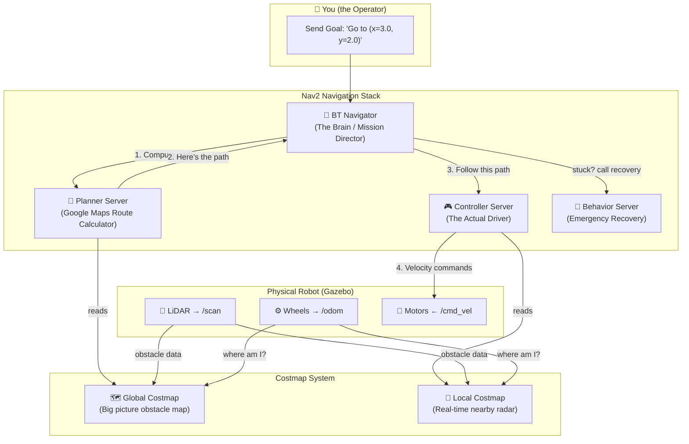
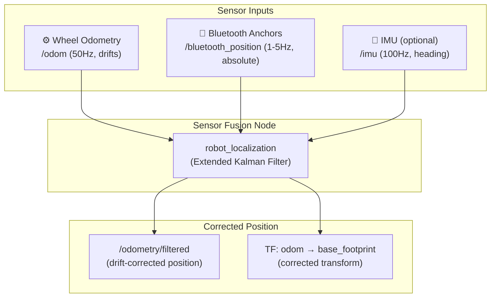
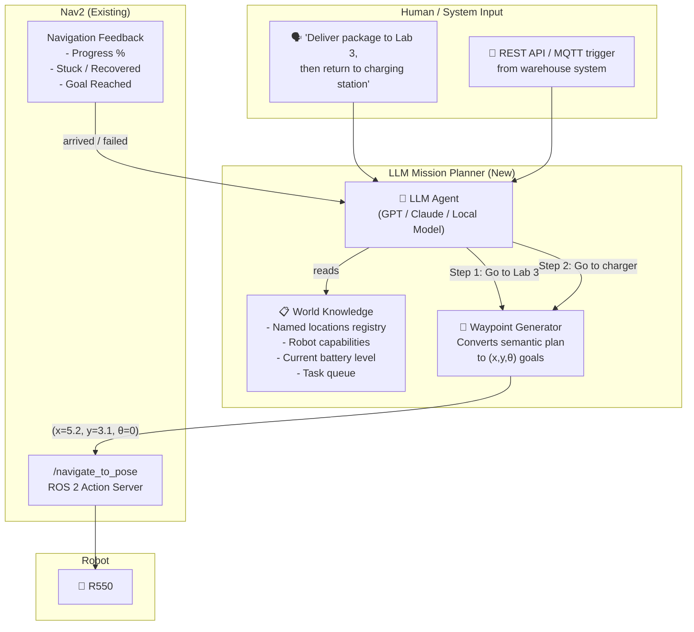

# Nav2 Deep Dive — How Your R550 Navigates from A to B

## Part 1: The Big Picture

When you tell the robot "go to point B", five separate systems collaborate in a pipeline. Think of it like Google Maps for robots:



---

## Part 2: Each Component Explained (Mapped to Your Config)

### 1. 🧠 BT Navigator — The Brain

**Config section:** `bt_navigator` in `config/nav2_params.yaml`

This is the **mission director**. When you send a navigation goal, it orchestrates everything using a **Behavior Tree (BT)** — a decision flowchart that looks like:

```
[NavigateToPose]
  → ComputePathToPose (ask the Planner)
  → FollowPath (tell the Controller)
  → If stuck → Recovery behaviors (spin, backup, wait)
  → If still stuck → Abort
```

The `plugin_lib_names` in your config are the BT "building blocks" that the tree can use:

```yaml
plugin_lib_names:
  - nav2_compute_path_to_pose_action_bt_node  # "Planner, compute a path!"
  - nav2_follow_path_action_bt_node           # "Controller, follow this path!"
  - nav2_back_up_action_bt_node               # "Emergency: drive backwards"
  - nav2_spin_action_bt_node                  # "Emergency: spin in place"
  - nav2_wait_action_bt_node                  # "Emergency: wait 5 seconds"
  - nav2_clear_costmap_service_bt_node        # "Clear stale obstacle data"
  - nav2_is_stuck_condition_bt_node           # "Am I stuck?"
  - nav2_goal_reached_condition_bt_node       # "Did I arrive?"
```

**Key setting:** `global_frame: odom` — This tells the brain that all coordinates are in the **odom frame** (relative to where the robot booted up). In a map-based system, this would be `map`.

---

### 2. 📐 Planner Server — The Route Calculator

**Config section:** `planner_server`

This computes the **global path** from your current position to the goal — like the blue line on Google Maps.

```yaml
GridTransition:
  plugin: "nav2_navfn_planner/NavFnPlanner"  # A* / Dijkstra algorithm
  use_astar: True       # A* is faster than Dijkstra (uses heuristic)
  allow_unknown: True   # Can plan through unexplored space
```

It reads the **global costmap** to know where obstacles are, and computes the cheapest path avoiding them.

**Why `allow_unknown: True` matters for you:** In mapless mode, most of the world is "unknown". Without this flag, the planner would refuse to compute any path because it hasn't seen the destination area yet.

---

### 3. 🎮 Controller Server — The Actual Driver

**Config section:** `controller_server` → `FollowPath`

Once the Planner gives a path (a list of waypoints), the Controller's job is to **actually steer the robot** along it in real-time, while dodging obstacles the LiDAR sees right now.

Your controller is **DWB (Dynamic Window-Based)** — it works by:
1. Simulating dozens of possible velocity combinations (forward speed × turn speed)
2. Scoring each one against "critics" (obstacle avoidance, path following, goal alignment)
3. Picking the best one and sending it as a `/cmd_vel` message

```yaml
FollowPath:
  plugin: "dwb_core::DWBLocalPlanner"
  max_vel_x: 0.4          # Never go faster than 0.4 m/s forward
  max_vel_theta: 1.0       # Never turn faster than 1.0 rad/s
  vx_samples: 20           # Try 20 different forward speeds
  vtheta_samples: 20       # Try 20 different turn speeds
  sim_time: 1.7            # Simulate 1.7 seconds into the future
```

The **critics** are scoring functions:

| Critic | What it Does |
|--------|-------------|
| `BaseObstacle` (scale: 0.02) | "Don't hit things" — but low weight, so it's a soft penalty |
| `PathAlign` (scale: 32.0) | "Stay aligned with the planned path direction" |
| `GoalAlign` (scale: 24.0) | "Face towards the final goal" |
| `PathDist` (scale: 32.0) | "Stay close to the planned path" |
| `GoalDist` (scale: 24.0) | "Get closer to the goal" |
| `RotateToGoal` | "At the very end, rotate to match the goal's heading" |
| `Oscillation` | "Don't jitter back and forth" |

**The two checkers:**
- **Progress Checker** — If the robot hasn't moved 0.5m in 10 seconds, it's "stuck" → triggers recovery
- **Goal Checker** — Arrived when within 15cm distance AND 0.25 rad heading of the goal

---

### 4. 🗺️ Costmaps — The Obstacle Maps

Costmaps are 2D grids where each cell has a "cost" from 0 (free) to 254 (lethal obstacle). The planner and controller use these to avoid crashes.

**Global Costmap** (for the Planner):
```yaml
rolling_window: True   # Moves with the robot (since there's no static map)
width: 20.0            # 20m × 20m grid centered on the robot
height: 20.0
resolution: 0.05       # 5cm per cell = 400×400 grid
```
- `obstacle_layer` → Marks cells where the LiDAR sees obstacles
- `inflation_layer` → Expands obstacles by 35cm buffer zone (your `inflation_radius`)

**Local Costmap** (for the Controller):
```yaml
rolling_window: True
width: 3.0             # Only 3m × 3m — just the immediate surroundings
height: 3.0
```
- Same layers, but smaller and updated 5× faster (5 Hz vs 1 Hz)

---

### 5. 🔄 Behavior Server — Emergency Recovery

When the robot gets stuck (Progress Checker triggers), the BT calls recovery behaviors:

```
1. Clear costmaps (remove stale obstacle data)
2. Spin 360° in place (look around for a way out)
3. Back up 0.3m
4. Try navigating again
5. If still stuck → abort the mission
```

---

## Part 2.1: Package Architecture — `navigation2` vs `nav2_bringup`

Your `package.xml` declares two Nav2 dependencies. Here's what each one provides:

**`navigation2`** is a **meta-package** — it contains no code itself. It's a dependency bundle that pulls in ~20 individual packages (the actual servers, algorithms, and plugins). Think of it like installing "Microsoft Office" which gives you Word, Excel, PowerPoint, etc.

**`nav2_bringup`** is a **launch utility** package — it contains pre-built `.launch.py` scripts and a default params template that wire all those servers together. Your `r550_nav2.launch.py` delegates to its `navigation_launch.py`.

### Which Sub-Packages Power Each System

**1. 🧠 BT Navigator → `nav2_bt_navigator` + `nav2_behavior_tree`**
- `nav2_bt_navigator` is the server process that receives your `/navigate_to_pose` action goal and runs the behavior tree
- `nav2_behavior_tree` provides the BT plugin library (the `plugin_lib_names` in your config)
- Your config controls: `bt_navigator:` section — which frame is global, which BT plugins to load

**2. 📐 Planner Server → `nav2_planner` + `nav2_navfn_planner`**
- `nav2_planner` is the server process — it listens for "compute a path" requests from the BT Navigator
- `nav2_navfn_planner` is the algorithm plugin you chose (A*/Dijkstra). Alternatives exist: `nav2_smac_planner` (lattice-based), `nav2_theta_star_planner` (any-angle paths)
- Your config controls: `planner_server:` → `GridTransition:` section

**3. 🎮 Controller Server → `nav2_controller` + `dwb_core`**
- `nav2_controller` is the server process — receives "follow this path" from BT Navigator
- `dwb_core` + `dwb_critics` is the algorithm plugin you chose (Dynamic Window). Alternatives: `nav2_regulated_pure_pursuit_controller` (smoother curves), `nav2_rotation_shim_controller`
- Your config controls: `controller_server:` → `FollowPath:` section

**4. 🗺️ Costmaps → `nav2_costmap_2d`**
- A single package providing both global and local costmap instances
- Layer plugins (`ObstacleLayer`, `InflationLayer`, `StaticLayer`, `VoxelLayer`) are all inside this package
- Costmaps are **not** separate processes — they run as components *inside* the planner server (global) and controller server (local)
- Your config controls: `global_costmap:` and `local_costmap:` sections

**5. 🔄 Behavior Server → `nav2_behaviors`**
- Provides `Spin`, `BackUp`, `Wait` recovery action plugins
- Called by the BT Navigator when the progress checker detects the robot is stuck
- Your config controls: `behavior_server:` section

**Infrastructure (behind the scenes):**
- `nav2_lifecycle_manager` — Starts/stops all servers in the correct order using ROS 2 lifecycle management (this is what `use_lifecycle_mgr: 'true'` enables in your launch file)
- `nav2_msgs` — Defines the `NavigateToPose` action type (the "contract" between you and the BT Navigator)
- `nav2_core` — Base C++ interfaces that all planner/controller/behavior plugins inherit from

### What `navigation_launch.py` Actually Launches

When your `r550_nav2.launch.py` includes `navigation_launch.py`, it starts exactly these 5 processes:

```
nav2_bt_navigator      ← BT Navigator (the orchestrator)
nav2_planner           ← Planner Server (runs NavFn/A*)
nav2_controller        ← Controller Server (runs DWB)
nav2_behaviors         ← Behavior Server (spin/backup/wait)
nav2_lifecycle_manager ← Lifecycle Manager (supervises the above 4)
```

Each one reads its config from your `nav2_params.yaml`. The full launch chain looks like:

```
Your r550_nav2.launch.py
  └── includes: nav2_bringup/navigation_launch.py
        ├── starts: nav2_bt_navigator        (from navigation2 → nav2_bt_navigator)
        ├── starts: nav2_planner             (from navigation2 → nav2_planner)
        ├── starts: nav2_controller          (from navigation2 → nav2_controller)
        ├── starts: nav2_behaviors           (from navigation2 → nav2_behaviors)
        └── starts: nav2_lifecycle_manager   (from navigation2 → nav2_lifecycle_manager)
                      ↑
              all configured by: your config/nav2_params.yaml
```

### Why Both Dependencies in `package.xml`

```xml
<exec_depend>navigation2</exec_depend>   <!-- Installs all the server packages -->
<exec_depend>nav2_bringup</exec_depend>  <!-- Installs the launch scripts you reference -->
```

You need both because `navigation2` doesn't include `nav2_bringup` (they're in separate repos). Without `nav2_bringup`, the `navigation_launch.py` file your launch script references wouldn't exist. Without `navigation2`, none of the actual server executables would be installed.

> [!TIP]
> You didn't write any navigation code — you just configured which algorithms to use and tuned their parameters via `nav2_params.yaml`. That's the power of Nav2's plugin architecture. Every component (planner, controller, behavior, costmap layer) is a swappable plugin.

---

## Part 3: The TF (Transform) Chain — How the Robot Knows "Where Am I?"

Every component needs to know where the robot is. ROS 2 uses a tree of coordinate frame transforms:

```
odom (world-fixed reference, origin = where robot booted)
 └── base_footprint (robot's ground contact point)
      └── base_link (robot's center body)
           ├── front_left_wheel
           ├── front_right_wheel
           ├── back_left_wheel
           ├── back_right_wheel
           └── laser_link (LiDAR sensor)
```

**Who publishes what:**
- `odom → base_footprint` — The diff_drive Gazebo plugin (from wheel odometry)
- Everything below — The `robot_state_publisher` (from URDF fixed joints)

> [!IMPORTANT]
> In mapless mode, there is NO `map → odom` transform. The `odom` frame IS the global frame. This means:
> - Position **drifts** over time (odometry accumulates error)
> - Goals are relative to where the robot started, not to an absolute world position
> - This is fine for short-range navigation (go 5m forward, turn left, etc.)

---

## Part 4: 🔵 Improvement — Bluetooth Anchor Positioning

This is where it gets exciting. Bluetooth anchors solve the **biggest weakness** of your mapless setup: **odometry drift**. Here's the architecture:

### The Problem
Your robot only knows its position via wheel odometry (`/odom`). Over time, wheel slip and sensor noise cause the estimated position to drift away from reality. After driving 50 meters, you might be 2 meters off.

### The Solution: Sensor Fusion with Bluetooth Anchors



### Implementation Path (3 Steps)

#### Step 1: Create a Bluetooth Anchor ROS 2 Node

You'd write a custom Python node that:
- Reads Bluetooth RSSI / BLE angle-of-arrival data from your anchor hardware
- Triangulates the robot's absolute (x, y) position
- Publishes it as a standard ROS 2 message

```python
# Conceptual example — src/r550_bt_anchor/bt_anchor_node.py
import rclpy
from rclpy.node import Node
from geometry_msgs.msg import PoseWithCovarianceStamped

class BluetoothAnchorNode(Node):
    def __init__(self):
        super().__init__('bluetooth_anchor_node')
        self.publisher = self.create_publisher(
            PoseWithCovarianceStamped,
            '/bluetooth_position',
            10
        )
        # Timer to poll BT hardware at 2 Hz
        self.create_timer(0.5, self.poll_anchors)

    def poll_anchors(self):
        # Read from your BLE SDK / serial port / MQTT
        x, y = self.triangulate_from_anchors()

        msg = PoseWithCovarianceStamped()
        msg.header.stamp = self.get_clock().now().to_msg()
        msg.header.frame_id = 'odom'  # or 'map' if you add a map frame
        msg.pose.pose.position.x = x
        msg.pose.pose.position.y = y
        # Covariance tells the Kalman filter how much to trust this reading
        # Higher values = less trust. BT anchors typically ±0.5m accuracy
        msg.pose.covariance[0] = 0.25   # x variance (0.5m)²
        msg.pose.covariance[7] = 0.25   # y variance
        self.publisher.publish(msg)
```

#### Step 2: Add `robot_localization` (EKF) for Sensor Fusion

The `robot_localization` package provides an Extended Kalman Filter that fuses multiple position sources. Add it to your system:

```yaml
# config/ekf_params.yaml
ekf_filter_node:
  ros__parameters:
    use_sim_time: true
    frequency: 30.0
    two_d_mode: true                    # ground robot, ignore z/roll/pitch

    odom_frame: odom
    base_link_frame: base_footprint
    world_frame: odom

    # Source 1: Wheel odometry (fast but drifts)
    odom0: /odom
    odom0_config: [true, true, false,   # x, y, z
                   false, false, true,   # roll, pitch, yaw
                   true, true, false,    # vx, vy, vz
                   false, false, true,   # vroll, vpitch, vyaw
                   false, false, false]  # ax, ay, az

    # Source 2: Bluetooth anchors (slow but absolute)
    pose0: /bluetooth_position
    pose0_config: [true, true, false,    # x, y (absolute position)
                   false, false, false,
                   false, false, false,
                   false, false, false,
                   false, false, false]
```

The EKF continuously blends both signals: it trusts wheel odometry for smooth short-term motion, and trusts Bluetooth anchors for long-term position correction. The `covariance` values in each message tell the filter how much to weight each source.

#### Step 3: Wire It Into Nav2

Update your Nav2 config to use the EKF's corrected output instead of raw odometry:

```yaml
# In nav2_params.yaml, change the odom topic references:
bt_navigator:
  ros__parameters:
    odom_topic: /odometry/filtered    # ← use fused output

controller_server:
  ros__parameters:
    odom_topic: /odometry/filtered    # ← use fused output
```

And in the diff_drive plugin in your URDF, **disable** its TF publishing (since the EKF will now publish `odom → base_footprint`):
```xml
<publish_odom_tf>false</publish_odom_tf>  <!-- EKF handles this now -->
```

---

### Alternative Approach: Full Map-Based Navigation

If your Bluetooth anchors are mounted at **known, fixed positions** (like in a warehouse), you could go further and create a proper `map` frame:

```
map (absolute world coordinates, anchored by Bluetooth)
 └── odom (odometry-relative, corrects drift via EKF)
      └── base_footprint
           └── ...
```

This gives you:
- **Absolute positioning** — the robot knows its warehouse coordinates
- **Pre-built maps** — you could SLAM first, then use AMCL + Bluetooth for localization
- **Persistent navigation** — goals like "go to shelf A3" instead of "go 5m forward"

But this is a bigger architectural change — your current mapless approach is the right starting point.

---

## Part 5: Quick Reference — How to Send a Goal

Once everything is launched, you can send a navigation goal via CLI:

```bash
# Send the robot to position (3.0, 2.0) in the odom frame
ros2 action send_goal /navigate_to_pose nav2_msgs/action/NavigateToPose \
  "{pose: {header: {frame_id: 'odom'}, pose: {position: {x: 3.0, y: 2.0, z: 0.0}, orientation: {w: 1.0}}}}"
```

Or via RViz2's "Nav2 Goal" button (click on the map to set destination).

---

## Part 6: 🤖 Future Exploration — LLM-Based Mission Planning

> [!NOTE]
> This section is a design exploration for future development. None of this is implemented yet.

### The Idea

Today, Nav2's planning is purely geometric — A* finds the shortest obstacle-free path on a grid. It has no concept of *semantics* (what things are), *priorities* (which task is more urgent), or *multi-step missions* (deliver package to room A, then pick up from room B).

An LLM could serve as a **high-level mission planner** that sits *above* Nav2, translating natural language or business logic into sequences of Nav2 goals.

### Architecture: LLM as the Mission Layer



### What the LLM Would Handle vs. What Nav2 Handles

| Responsibility | Who Handles It | Example |
|---------------|---------------|---------|
| "Where is Lab 3?" | **LLM** (semantic lookup) | Queries a location registry → (5.2, 3.1) |
| "What's the shortest path to (5.2, 3.1)?" | **Nav2** (geometric planning) | A* on costmap |
| "Should I charge first or deliver first?" | **LLM** (task prioritization) | Checks battery level, decides order |
| "There's a person blocking the hallway" | **Nav2** (reactive avoidance) | DWB controller dodges obstacle |
| "The hallway is always crowded at 5 PM" | **LLM** (strategic re-routing) | Suggests alternative waypoints |
| "I'm stuck, what should I do?" | **Nav2 first**, then **LLM** | Nav2 tries spin/backup; if still stuck, LLM suggests alternative goal |

### Implementation Approach: ROS 2 Action Client Node

The LLM planner would be a ROS 2 node that acts as a **client** of Nav2's action server:

```python
# Conceptual — src/r550_llm_planner/mission_planner_node.py
import rclpy
from rclpy.node import Node
from rclpy.action import ActionClient
from nav2_msgs.action import NavigateToPose
from geometry_msgs.msg import PoseStamped
import openai  # or any LLM SDK

class MissionPlannerNode(Node):
    """
    High-level mission planner that uses an LLM to decompose
    natural language commands into Nav2 waypoint sequences.
    """
    def __init__(self):
        super().__init__('llm_mission_planner')
        self.nav_client = ActionClient(self, NavigateToPose, 'navigate_to_pose')

        # Known locations (could be loaded from YAML or a database)
        self.locations = {
            'charging_station': (0.0, 0.0, 0.0),
            'lab_3': (5.2, 3.1, 1.57),
            'main_entrance': (8.0, 0.0, 3.14),
            'storage_room': (-2.0, 4.0, 0.0),
        }

        # Subscribe to mission commands (from a web UI, voice, etc.)
        self.create_subscription(String, '/mission_command', self.on_command, 10)

    def on_command(self, msg):
        """Receive a natural language command and plan a mission."""
        command = msg.data  # e.g., "Deliver to Lab 3, then come back"

        # Ask the LLM to decompose into steps
        plan = self.ask_llm(command)
        # plan = ["go to lab_3", "wait 30 seconds", "go to charging_station"]

        for step in plan:
            location_name = self.extract_location(step)
            if location_name in self.locations:
                x, y, theta = self.locations[location_name]
                success = self.navigate_to(x, y, theta)
                if not success:
                    # Ask LLM for fallback plan
                    fallback = self.ask_llm(f"Navigation to {location_name} failed. What should I do?")
                    self.execute_fallback(fallback)

    def ask_llm(self, prompt):
        """Query the LLM with robot context for mission decomposition."""
        system_prompt = f"""You are a robot mission planner for an R550 ground robot.
        Known locations: {list(self.locations.keys())}
        Current position: {self.get_current_position()}
        Battery level: {self.get_battery_level()}%

        Decompose the user's command into a JSON list of steps.
        Each step must reference a known location or a wait action.
        """
        response = openai.chat.completions.create(
            model="gpt-4o-mini",
            messages=[
                {"role": "system", "content": system_prompt},
                {"role": "user", "content": prompt}
            ]
        )
        return json.loads(response.choices[0].message.content)

    async def navigate_to(self, x, y, theta):
        """Send a Nav2 goal and wait for completion."""
        goal = NavigateToPose.Goal()
        goal.pose.header.frame_id = 'odom'
        goal.pose.header.stamp = self.get_clock().now().to_msg()
        goal.pose.pose.position.x = x
        goal.pose.pose.position.y = y
        # Convert theta to quaternion...
        goal.pose.pose.orientation.w = math.cos(theta / 2)
        goal.pose.pose.orientation.z = math.sin(theta / 2)

        self.nav_client.wait_for_server()
        result = await self.nav_client.send_goal_async(goal)
        return result.status == GoalStatus.STATUS_SUCCEEDED
```

### Key Design Decisions to Explore

| Decision | Options | Trade-offs |
|----------|---------|-----------|
| **LLM location** | Cloud API vs. local model (Ollama) | Latency vs. capability. Cloud is smarter; local works offline |
| **Location registry** | Hardcoded YAML vs. SLAM-learned semantic map | YAML is simple; semantic maps enable "go near the red shelf" |
| **Feedback loop** | One-shot plan vs. continuous re-planning | One-shot is simpler; continuous handles dynamic environments |
| **Safety layer** | LLM directly sends goals vs. human-in-the-loop approval | Direct is faster; approval is safer for early development |
| **Multi-robot** | Single planner vs. fleet coordinator | Single is your starting point; fleet needs task allocation |

### Potential Use Cases

1. **Warehouse delivery**: "Pick up from station A, deliver to stations B and C, prioritize C if battery > 50%"
2. **Patrol missions**: "Patrol the perimeter every 30 minutes, report if any new obstacles detected"
3. **Voice control**: "Come to me" (uses BT anchor to locate the speaker)
4. **Anomaly response**: Robot detects unusual sensor readings → asks LLM "what should I investigate?"
5. **Natural language waypoints**: "Go to the corner near the window" → LLM resolves to coordinates

### Getting Started (When Ready)

1. Build a simple location registry (YAML file with named positions)
2. Create a ROS 2 Python node that reads from `/mission_command` topic
3. Start with rule-based decomposition (no LLM yet) — just parse "go to X" commands
4. Add LLM integration once the basic pipeline works
5. Add feedback loop: report navigation results back to the LLM for re-planning

---

## Summary

| Concept | Your Setup | With Bluetooth Anchors | With LLM Planner |
|---------|-----------|----------------------|------------------|
| Position source | Wheel odometry only | EKF: wheels + Bluetooth | Same (LLM doesn't affect positioning) |
| Global frame | `odom` (relative) | `map` (absolute) | `map` (absolute) |
| Goal input | Manual coordinates | Manual coordinates | Natural language / API |
| Mission complexity | Single A→B | Single A→B | Multi-step missions with logic |
| Intelligence | None (geometric only) | None (geometric only) | Semantic understanding + re-planning |
